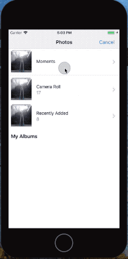
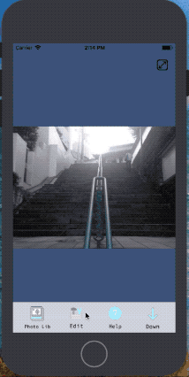
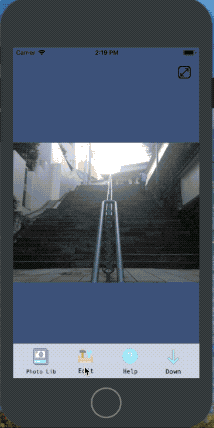

# EPP Edit Photo Project

## 프로젝트 요약
 빠르게 변하는 최신 머신러닝 기술들을 활용해 영상처리를 하는 iOS앱을 만들었습니다. 사용자들에게 흥미로운 사진처리 서비스들을 제공하는 App입니다. 크게 영상처리 기능으로는 1) 특정 사진의 패턴(풍경, 사람, 사물등)을 학습해, 사용자가 사진에서 원하는 부분을 특정패턴으로 채울 수 있는 기능. 2) 사진에서 사람을 검출(detect)해서 가려주는 기능. 3) 머신러닝 영상처리 기능중 하나인 style transfer 기능을 구현 하였습니다.


|                    inpaint model                     |                     detect model                  |                     style transfer model                  |
| :----------------------------------------------------------: | :-------------------------------------------------------: | :-------------------------------------------------------: |
|  |  |  |


## 구현 사항
* 앱 개발 사항들

사진 편집기능, swift 기반 코드들

cropping / Drawing / UI / photo picker / photo auto fit function / photo Download(server) / photo Upload(server)
/ story board design / Alert(no detection, photo download) / Navigation Controller / Asset design etc...

* 서버 구축

구글 API firebase storage 이용
https://firebase.google.com/

python firebase usage
```python
import firebase_admin
cred = credentials.Certificate('path/to/json')
app = firebase_admin.initialize_app(cred, {
    'storageBucket': 'inpaint-server.appspot.com'
})
bucket = storage.bucket(app=app)
blob = bucket.blob("path/to/storage")
downloadfile = blob.download_as_string()
```

swift firebase usage
```swift
import FirebaseStorage
let storage = Storage.storage()
let storageRef = storage.reference()
let fileRef = storageRef.child('path/to/storage')
fileRef.getData(){
    // error Exceptions
    // data task
}
fileRef.putData(data, metadata){
    // error Exceptions
    // data task
}
```
사진?
* 딥러닝 관련

***Inpaint***

특정한 image set을 예제 모델에 이어서 훈련시킨 모델 사용, 비지도 학습의 일종인 GAN(생성적 적대 신경망)사용

inpaint 모델 흐름도


***Detect human***

Tensorfloe Detect API를 이용하여 구현

detect 모델 흐름도


***Style Transfer***

직접 훈련한 모델 사용, 비지도학습(unsupervised leraning) 사용

style 모델 흐름도


## 요구사항

* python 3.6+
* xcode 10.3+
* swift 5
* python interpreter : tensorflow 1.13 / numpy / opncv-python / pilow 6.1 / firebase 3.0.1 / h5py 2.9 / image 1.5.27 / neuralgym


## 참조

imagenet 모델 데이터셋:
http://www.image-net.org

place 모델 데이터셋:
http://places2.csail.mit.edu/download.html

Tensorflow detect API:
https://medium.com/@madhawavidanapathirana/real-time-human-detection-in-computer-vision-part-2-c7eda27115c6

Inpaint :
https://github.com/JiahuiYu/generative_inpainting

Style transfer :
https://github.com/lengstrom/fast-style-transfer
